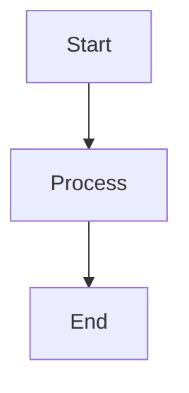

# AtCoder 学習教材セット — 技術制約

## 概要

本ドキュメントは、AtCoder学習教材セット自動生成プロジェクトの技術的制約・品質基準・成果物構造を定義する。

---

## 言語

### 主要言語: C++17

- **殿の主力言語**
- `#include <bits/stdc++.h>` 使用可
- コードは必ずコンパイル可能な完全な形で記載する（スニペット・省略禁止）
- 標準: C++17（AtCoder Judge と同バージョン）

### 補助言語: Python3

- 比較・説明用として使用（講座の概念理解補助）
- C++ と Python の対比で理解を深める場合に使用
- Python コードも完全実装を原則とする

### コード記法

```cpp
// 必ず以下のフォーマットで記載
#include <bits/stdc++.h>
using namespace std;

int main() {
    // 入力
    int n;
    cin >> n;

    // 処理
    // ...

    // 出力
    cout << answer << endl;
    return 0;
}
```

---

## 問題参照

### AtCoder Problems API

- API エンドポイント: `kenkoooo.com/atcoder/resources/`
- 問題難易度 (difficulty): AtCoder Problems の推定 difficulty 値を使用
- difficulty 値の信頼性: 500問以上のデータがある問題は高精度

### ABC問題 URL形式

```
https://atcoder.jp/contests/abc{NNN}/tasks/abc{NNN}_{問題番号}
```

例:
- ABC188-C: `https://atcoder.jp/contests/abc188/tasks/abc188_c`
- ABC209-D: `https://atcoder.jp/contests/abc209/tasks/abc209_d`

**注意**: 問題番号は実在するもののみ記載。推定・捏造は厳禁。

### difficulty レート帯対応

| difficulty | レート帯 | 対象Week |
|-----------|---------|---------|
| ~400 | 灰色 | Week 1-3 |
| 400-799 | 茶色 | Week 1-8 |
| 800-1199 | 緑色 | Week 9-18 |
| 1200-1599 | 水色 | Week 19-24（発展） |

---

## 教材フォーマット

### 全体フォーマット

- **全ファイル**: Markdown形式（.md）
- **文字コード**: UTF-8
- **改行コード**: LF

### コードブロック

言語を必ず指定する:

~~~
```cpp
// C++ コード
```

```python
# Python コード
```
~~~

### 図解

テキストで表現できる場合はASCIIアートを使用:

```
例: BFSの探索順序
     1
    / \
   2   3
  / \   \
 4   5   6

探索順: 1 → 2 → 3 → 4 → 5 → 6
```

Mermaid記法も使用可（GitHub Markdown対応環境向け）:



---

## 成果物ディレクトリ構造

```
atcoder_materials/
├── pre-docs/                    ← このSDD pre-docs群
│   ├── 01_requirements.md       ← 要件定義 (ashigaru1)
│   ├── 02_curriculum_mapping.md ← カリキュラム設計 (ashigaru2)
│   ├── 03_tech_constraints.md   ← 技術制約 (ashigaru3) ← このファイル
│   ├── 04_sdd_phase_design.md   ← SDDフェーズ設計 (ashigaru3)
│   └── 05_quality_criteria.md   ← 品質基準 (ashigaru4)
├── outputs/                     ← /run-phase で生成される教材
│   ├── phase-01/
│   │   ├── week-01/
│   │   │   ├── lecture.md       ← 解説ファイル
│   │   │   └── practice.md      ← 練習問題ファイル
│   │   └── week-02/
│   │       ├── lecture.md
│   │       └── practice.md
│   ├── phase-02/
│   │   ├── week-03/
│   │   ├── week-04/
│   │   ├── week-05/
│   │   └── week-06/
│   ├── phase-03/
│   │   ├── week-07/ 〜 week-12/
│   ├── phase-04/
│   │   ├── week-13/ 〜 week-18/
│   └── phase-05/
│       ├── week-19/ 〜 week-24/
└── README.md                    ← プロジェクト概要
```

合計出力ファイル数: 24週 × 2ファイル = **48ファイル**

---

## 品質基準

### lecture.md

| 項目 | 基準 |
|------|------|
| ファイルサイズ | 500〜1500行を目安 |
| コード量 | 完全実装1〜3例（スニペット禁止） |
| 解説レベル | 初心者（茶〜緑境界）が読んで理解できるレベル |
| 計算量記載 | 必須（O(N)・O(N log N) 等） |

### practice.md

| 項目 | 基準 |
|------|------|
| 推奨問題数 | 5問以上（実在ABC問題） |
| ヒント形式 | 3段階（方向性 → アルゴリズム名 → 実装骨格） |
| 模範解答 | C++17 完全実装 + 行コメント + 計算量 |
| 発展問題 | 任意（余力がある場合） |

### 共通禁止事項

- **コード省略**: `// ... 省略 ...` 禁止。必ず完全実装。
- **問題URL捏造**: 存在しないABC問題番号の記載禁止。
- **difficulty値の推定記載**: 不明な場合は「difficulty: 不明」と明記。
- **前提知識の突然の使用**: 当週カリキュラムの範囲外の手法を無断で使用しない。

---

## 環境・実行制約

### AtCoder Judge 環境

- C++17 (GCC 9.2.1)
- メモリ制限: 256MB（問題により異なる）
- 時間制限: 2秒（問題により異なる）

### 教材内のコード基準

- TLE しない計算量のアルゴリズムを選択
- MLE しないメモリ量を意識（配列サイズに注意）
- 制約 N ≤ 2×10⁵ を基本ケースとして設計

---

*作成: subtask_062a3 (ashigaru3) | 2026-03-19*
*参照: 01_requirements.md, 02_curriculum_mapping.md（作成中）*
